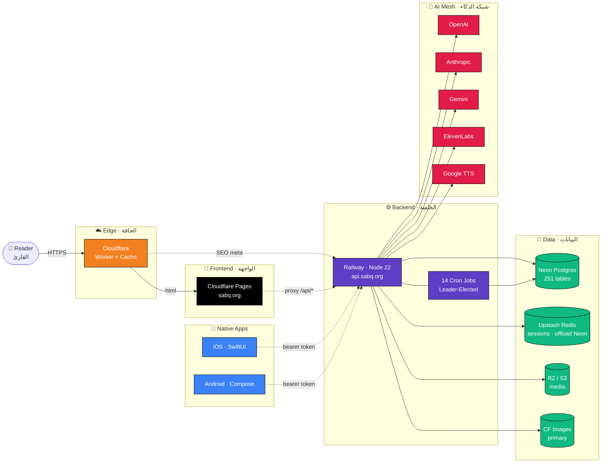

<!--
  ╔══════════════════════════════════════════════════════════════════╗
  ║                                                                  ║
  ║   سَبق · Sabq Smart                                              ║
  ║   The first AI-native Arabic newsroom                            ║
  ║   منصّة إخبارية ثلاثية اللغات مدفوعة بالذكاء الاصطناعي           ║
  ║                                                                  ║
  ╚══════════════════════════════════════════════════════════════════╝
-->

<div align="center">

<br/>

```
 ███████╗ █████╗ ██████╗  ██████╗
 ██╔════╝██╔══██╗██╔══██╗██╔═══██╗
 ███████╗███████║██████╔╝██║   ██║
 ╚════██║██╔══██║██╔══██╗██║▄▄ ██║
 ███████║██║  ██║██████╔╝╚██████╔╝
 ╚══════╝╚═╝  ╚═╝╚═════╝  ╚══▀▀═╝
```

# سَبق الذكية · Sabq Smart

**منصّة إخبارية ثلاثية اللغات مدفوعة بالذكاء الاصطناعي**
*The first AI-native Arabic newsroom — trilingual, multi-platform, production at scale.*

<br/>

[](https://github.com/sabq4org/sabq.org/releases)
[](https://github.com/sabq4org/sabq.org/commits)
[](https://github.com/sabq4org/sabq.org/graphs/contributors)
[](https://github.com/sabq4org/sabq.org/stargazers)
[](https://github.com/sabq4org/sabq.org/issues)
[](LICENSE)

<br/>

[](https://react.dev)
[](https://www.typescriptlang.org)
[](https://nodejs.org)
[](https://expressjs.com)
[](https://www.postgresql.org)
[](https://orm.drizzle.team)

[](https://vitejs.dev)
[](https://tailwindcss.com)
[](https://developer.apple.com/xcode/swiftui)
[](https://developer.android.com/jetpack/compose)
[](https://workers.cloudflare.com)
[](https://railway.app)

<br/>

[;5+%D9%85%D8%B2%D9%88%D9%91%D8%AF%D9%8A+%D8%B0%D9%83%D8%A7%D8%A1+%D8%A7%D8%B5%D8%B7%D9%86%D8%A7%D8%B9%D9%8A;14+%D9%85%D9%87%D9%85%D8%A9+%D8%AE%D9%84%D9%81%D9%8A%D8%A9+(cron)" alt="Live stats" />](#-glance--%D9%84%D9%85%D8%AD%D8%A9)

<br/>

**[🌐 Live · sabq.org](https://sabq.org)** ·
**[📱 iOS](https://apps.apple.com/sa/app/sabq)** ·
**[🤖 Android](https://play.google.com/store/apps/details?id=com.sabqorg.sabq)** ·
**[📖 Docs](docs/)** ·
**[🐛 Report bug](https://github.com/sabq4org/sabq.org/issues/new)**

</div>

---

<!-- LANGUAGE TOGGLE -->
<p align="center">
  <a href="#-overview--نظرة-عامة"><b>🇸🇦 العربية</b></a>
  ·
  <a href="#-overview--نظرة-عامة"><b>🇬🇧 English</b></a>
</p>

---

## 🌟 Overview · نظرة عامة

<table>
<tr>
<td width="50%" valign="top">

### 🇬🇧 English

**Sabq** is a production-grade trilingual news platform that integrates AI deeply into every editorial surface — not as a chat widget, but woven into authoring, moderation, summarization, recommendation, and voice synthesis.

It powers a real newsroom: writers compose with an AI co-pilot, editors approve through gated workflows, articles flow into web + iOS + Android with localized SEO, and millions of readers consume them across three languages.

</td>
<td width="50%" valign="top">

### 🇸🇦 العربية

**سَبق** منصّة إخبارية إنتاجية ثلاثية اللغات تُدمج الذكاء الاصطناعي بعمق في كل سطح تحريري — ليس كَمحادثة مرفقة، بل منسوجاً في الكتابة والإشراف والتلخيص والتوصية وتحويل النص إلى صوت.

تشغّل غرفة تحرير حقيقية: الكُتّاب يكتبون مع مساعد ذكي، والمحرّرون يوافقون عبر مسارات محكومة، والمقالات تنساب إلى الويب وiOS وأندرويد بـ SEO مَحلَّن، ويستهلكها ملايين القرّاء بثلاث لغات.

</td>
</tr>
</table>

---

## 🔎 Glance · لمحة

<div align="center">

| | 🇬🇧 | 🇸🇦 |
|---|---|---|
| 📊 Database tables | **251** (Drizzle ORM) | **251** جدول |
| 🛡️ RBAC | **9** roles · **164** permissions · **344** mappings | **9** أدوار · **164** صلاحية · **344** ربط |
| 🌍 Languages | **3** (Arabic · English · Urdu) | **3** لغات |
| 🤖 AI providers | **5** (OpenAI · Anthropic · Gemini · ElevenLabs · Google TTS) | **5** مزوّدات |
| ⏰ Background jobs | **14** node-cron jobs with leader election | **14** مهمة خلفية |
| 📱 Native apps | **iOS** SwiftUI · **Android** Compose · **Web** Vite SPA | **iOS** و**أندرويد** نيتيف |
| 🚀 Deploy topology | Cloudflare Pages + Railway · Upstash Redis (جلسات — تخفيف Neon) | Pages + Railway + Redis |

</div>

---

## 🏗️ Architecture · المعمارية



> **Note:** الإنتاج على **sabq.org** = Cloudflare Pages + Railway (`api.sabq.org`) + Neon + Upstash Redis للجلسات. انظر [`docs/DEPLOYMENT_STATUS.md`](docs/DEPLOYMENT_STATUS.md).

---

## 🚀 Quickstart · البدء السريع

```bash
# 1. Clone · استنساخ
git clone https://github.com/sabq4org/sabq.org.git && cd sabq.org

# 2. Install · تثبيت
npm install

# 3. Configure · تكوين
cp .env.example .env   # then fill in API keys

# 4. Sync schema · مزامنة المخطط
npm run db:push

# 5. Run · تشغيل
npm run dev            # API + SPA on http://localhost:5000
```

<table>
<tr>
<td>

**🇬🇧** Open `http://localhost:5000` — Express serves the API **and** the Vite SPA on the same port. No second dev server needed.

</td>
<td>

**🇸🇦** افتح `http://localhost:5000` — Express يخدم الـ API و SPA على نفس المنفذ. لا حاجة لتشغيل خادم Vite منفصل.

</td>
</tr>
</table>

---

## 📦 Tech Stack · المُكدَّس التقني

<table>
<tr>
<th width="20%">Layer</th>
<th width="80%">Technologies</th>
</tr>

<tr>
<td><b>🎨 Frontend</b><br/>الواجهة</td>
<td>

React 18 · Vite 5 · TypeScript 5 · Wouter (routing) · TanStack Query · Tailwind 3 · Radix UI · shadcn/ui · TipTap 3 · Framer Motion · React Hook Form

</td>
</tr>

<tr>
<td><b>⚙️ Backend</b><br/>الخلفية</td>
<td>

Node.js 22 · Express 4 · TypeScript 5 · Passport (Local + Google + Apple) · Drizzle ORM · node-cron · esbuild (production bundle)

</td>
</tr>

<tr>
<td><b>💾 Data</b><br/>البيانات</td>
<td>

PostgreSQL (Neon Serverless · 251 tables) · Upstash Redis (sessions, hot cache) · Cloudflare Images (primary image store) · Cloudflare R2 / S3 (PDFs, audio, presigned uploads)

</td>
</tr>

<tr>
<td><b>🤖 AI</b><br/>الذكاء</td>
<td>

OpenAI · Anthropic Claude · Google Gemini · ElevenLabs (multi-voice TTS) · Google Cloud TTS · OpenAI embeddings · Custom recommendation engine

</td>
</tr>

<tr>
<td><b>📱 Mobile</b><br/>الموبايل</td>
<td>

<b>iOS</b>: native SwiftUI app, deployment target 17.0 · <b>Android</b>: native Jetpack Compose (in development) · Legacy Capacitor 7.4.4 wrapper still maintained

</td>
</tr>

<tr>
<td><b>☁️ Platform</b><br/>المنصّة</td>
<td>

Cloudflare (Pages, Workers, DNS, Images, R2) · Railway (Node API) · Neon (Postgres) · Upstash (Redis sessions)

</td>
</tr>

</table>

---

## 🤖 AI Capabilities · القدرات الذكية

<details open>
<summary><b>Click to expand · اضغط للتوسيع</b></summary>

<br/>

<table>
<tr>
<td width="50%" valign="top">

#### 🇬🇧 English

1. **Smart bullets** — 3-sentence article summary, gpt-4o-mini, 8s timeout, persisted to DB
2. **iFox content generation** — full editorial assistant: titles, drafts, fact-checks, paraphrasing
3. **Daily Brief** — personalized daily report (top stories, your interests, reading streak)
4. **Smart Links** — entity recognition: people, places, events auto-linked inline
5. **Recommendation engine** — collaborative + content filtering, embeddings backed
6. **Comment moderation** — gpt-4o-mini for sentiment + safety + Arabic dialect understanding
7. **Voice summaries** — ElevenLabs multi-voice library, Arabic-native, per-article audio
8. **Trilingual SEO** — per-route OG / Twitter / JSON-LD / hreflang automatic injection
9. **Deep analysis engine** — long-form generated insights (`/omq`)
10. **Email-to-article agent** — editors send an email → article + image extraction + draft

</td>
<td width="50%" valign="top">

#### 🇸🇦 العربية

1. **النقاط الذكية** — تلخيص ٣ نقاط لكل مقال، gpt-4o-mini، مهلة ٨ ثوانٍ
2. **توليد iFox** — مساعد تحريري كامل: عناوين، مسوّدات، تحقّق، إعادة صياغة
3. **الموجز اليومي** — تقرير مخصّص (أهم القصص، اهتماماتك، تَتابعك في القراءة)
4. **الروابط الذكية** — تعرّف الكيانات: أشخاص، أماكن، أحداث تُربط تلقائياً
5. **محرك التوصيات** — تصفية تعاونية + محتوى مدعومة بـ embeddings
6. **إشراف التعليقات** — gpt-4o-mini لِفهم المشاعر + السلامة + اللهجات العربية
7. **الملخّصات الصوتية** — مكتبة ElevenLabs متعددة الأصوات، عربية أصيلة
8. **SEO ثلاثي اللغات** — حقن OG / Twitter / JSON-LD / hreflang تلقائياً
9. **محرك التحليل العميق** — رؤى مولّدة موسّعة (`/omq`)
10. **وكيل البريد إلى مقال** — يُرسل المحرّر بريداً → مقال + استخراج صور + مسوّدة

</td>
</tr>
</table>

</details>

---

## 📁 Project Structure · بنية المشروع

```
sabq.org/
├── 🎨 client/                 React + Vite SPA
│   ├── src/components/        UI primitives (shadcn) + feature components
│   ├── src/pages/             Wouter route-level views
│   ├── src/lib/               apiClient, queryClient, utilities
│   └── src/nav/               Trilingual navigation (ar/en/ur)
│
├── ⚙️ server/                  Express monolith
│   ├── routes.ts              ~37k-line historical monolith
│   ├── routes/                Newer modular routers
│   ├── services/              Domain services (AI, images, push, ifox)
│   ├── jobs/                  14 cron jobs (node-cron) + leader election
│   ├── ai/                    AI provider abstractions
│   ├── auth.ts                Passport + sessions + cross-domain cookies
│   └── seoInjector.ts         Per-route head rewriting (OG/JSON-LD/hreflang)
│
├── 💾 shared/
│   └── schema.ts              Drizzle schema — 251 tables, ~12k lines
│
├── 📱 sabq app ios/            Native SwiftUI app (iOS 17+)
├── 🤖 android-native/          Native Jetpack Compose (in development)
├── 📦 android/ + ios/          Legacy Capacitor wrappers
│
├── ☁️ cloudflare-worker/       Edge Worker (SEO meta, image transforms)
├── 🐳 Dockerfile               Railway build source
├── 🚂 railway.json             Railway config-as-code
└── ▲ vercel.json               Vercel build + rewrite config
```

---

## 🚀 Topologies · هيكل النشر

The same codebase supports two deployment modes via env flags — no code branches.

<table>
<tr>
<th>Mode</th>
<th>Domain</th>
<th>Status</th>
<th>Stack</th>
</tr>
<tr>
<td><b>🟢 Replit (legacy)</b></td>
<td><code>sabq.org</code></td>
<td><b>Production</b><br/>الإنتاج</td>
<td>Single Express process serves API + SPA on one port. Original topology, still production.</td>
</tr>
<tr>
<td><b>🟡 Vercel + Railway + CF</b></td>
<td><code>sabq.news</code></td>
<td>Experimental<br/>تجريبي</td>
<td>Frontend on Vercel, backend on Railway, Cloudflare in front. Split via env flags <code>SERVE_SPA=false</code>, <code>COOKIE_DOMAIN</code>, <code>VITE_API_URL</code>.</td>
</tr>
</table>

> 📘 Full architecture note: [`replit.md`](replit.md) · Deployment details: [`CLAUDE.md`](CLAUDE.md)

---

## 📱 Mobile · تطبيقات الموبايل

<table>
<tr>
<td width="50%" align="center">

### 🍎 iOS

<a href="https://apps.apple.com/sa/app/sabq">
  
</a>

<br/><br/>

**Native SwiftUI** · iOS 17+
TestFlight: `9.0.7+`
Bearer-token auth via `/api/v1`

Content Passport · Loyalty system · Audio newsletters · Push notifications (APNs)

</td>
<td width="50%" align="center">

### 🤖 Android

<a href="https://play.google.com/store/apps/details?id=com.sabqorg.sabq">
  
</a>

<br/><br/>

**Native Jetpack Compose** · in dev
Legacy Capacitor build available
Targeting full iOS parity

Article detail · Audio newsletters · Trending · Rewards · Search

</td>
</tr>
</table>

---

## 🔌 API · واجهات برمجية

<details>
<summary><b>Public endpoints (excerpt) · واجهات عامة (مختارة)</b></summary>

<br/>

| Method | Path | Purpose |
|--------|------|---------|
| `GET`  | `/api/articles` | Paginated article list (ar/en/ur via locale) |
| `GET`  | `/api/articles/:slug` | Single article |
| `GET`  | `/api/articles/:slug/ai-bullets` | 3-bullet AI summary |
| `GET`  | `/api/categories` | Category tree |
| `POST` | `/api/auth/login` | Local auth (Passport) |
| `POST` | `/api/auth/google` | Google OAuth |
| `POST` | `/api/auth/apple` | Apple OAuth |
| `GET`  | `/api/auth/user` | Current session info |
| `POST` | `/api/media/upload` | Multipart upload → CF Images / GCS |
| `GET`  | `/api/edge/seo-meta` | Edge-side SEO data (Cloudflare Worker) |
| `GET`  | `/api/edge/slug-redirect` | 301 redirects (Arabic slugs → English) |
| `*`    | `/api/v1/*` | Mobile-specific endpoints (bearer token) |

Full OpenAPI/Swagger docs available at `/api/docs` in development.

</details>

---

## 🛡️ Security · الأمان

- 🔒 **Multi-layer auth** — Passport sessions (web) + bearer tokens (mobile) + RBAC (9 roles, 164 permissions)
- 🍪 **Cross-subdomain cookies** — `SameSite=None` + `Secure` + `Domain=.sabq.org`
- 🛡️ **CSRF protection** — Lazy token fetch for state-changing requests
- 🔑 **2FA** — TOTP via `otplib` for admin accounts
- 🚦 **Rate limiting** — `cf-connecting-ip` keyed, anonymous writes throttled
- 🔍 **Magic-byte verification** — Uploaded images verified against claimed MIME (sharp)
- 🔐 **Cookie hardening** — `httpOnly`, `Secure` in production, rolling sessions

---

## 🤝 Contributors · المساهمون

<a href="https://github.com/sabq4org/sabq.org/graphs/contributors">
  
</a>

---

## 📊 Activity · النشاط

<div align="center">

[](https://github.com/sabq4org/sabq.org)

[](https://star-history.com/#sabq4org/sabq.org&Date)

</div>

---

## 📚 Documentation · التوثيق

- 📐 **Architecture** → [`replit.md`](replit.md), [`CLAUDE.md`](CLAUDE.md)
- 🐛 **Feature deep-dives** → [`docs/`](docs/)
- 🚀 **Releases** → [`docs/RELEASES.md`](docs/RELEASES.md)
- 🔐 **Auth & sessions** → [`docs/APPLE_PUSH_SETUP.md`](docs/APPLE_PUSH_SETUP.md)
- 📈 **SEO recovery plan** → [`docs/SEO_RECOVERY_PLAN.md`](docs/SEO_RECOVERY_PLAN.md)

---

## 🤝 Contributing · المساهمة

```bash
# Fork, branch, code, push, open PR
git checkout -b feat/your-feature
git commit -m "feat: ..."
git push origin feat/your-feature
```

Open a [Pull Request](https://github.com/sabq4org/sabq.org/pulls) against `main`. Production deploys auto-trigger on merge.

---

## 📄 License · الترخيص

<table>
<tr>
<td width="50%">

**MIT** © [Sabq Organization](https://sabq.org)

You are free to use, modify, and distribute this software with attribution.

</td>
<td width="50%">

**رخصة MIT** © [مؤسسة سبق](https://sabq.org)

يُسمح بالاستخدام والتعديل وإعادة التوزيع مع الإشارة إلى المصدر.

</td>
</tr>
</table>

---

<div align="center">

**Built with ☕ in Riyadh · صُنع بِشغف في الرياض**

<sub>If this project helps you, consider giving it a ⭐ — it really helps us reach more contributors.</sub>

<sub>إذا أفادك هذا المشروع، فكِّر في إعطائه ⭐ — يساعدنا في الوصول لمزيد من المساهمين.</sub>

</div>
