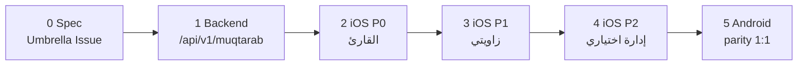

# خطة اعتماد قسم مُقترب في iOS — بكل خصائصه

> **المرجع التقني للقسم:** [`MUQTARAB.md`](MUQTARAB.md)  
> **المرجع المعماري:** [`AGENTS.md`](../AGENTS.md) · [`CLAUDE.md`](../CLAUDE.md)  
> **آخر تحديث:** 2026-06-06  
> **الحالة:** Spec — لم يبدأ التنفيذ

---

## 1) ملخص تنفيذي

قسم **مُقترب** مكتمل على **الويب** و**الـ Backend** (Passport `/api/muqtarab/*`)، لكنه **غير موجود** في تطبيق iOS الأصلي (`sabq app ios/`). المجلد القديم `ios/` (Capacitor) خارج النطاق — التطوير في `sabq app ios/` فقط.

**الهدف:** parity وظيفي كامل مع الويب على iOS (قارئ + كاتب زاوية + اختياري: إدارة)، مع **Android 1:1** بعد اعتماد iOS كمرجع بصري.

**الفجوة الحرجة:** لا توجد مسارات **`/api/v1/muqtarab/*`** للموبايل (Bearer). يجب بناءها **قبل** أي شاشة iOS.

```
الوضع الحالي:
  Web  ──► /api/muqtarab/*     (Passport session)     ✅
  iOS  ──► /api/v1/*           (Bearer)               ❌ لا muqtarab

الهدف:
  iOS  ──► /api/v1/muqtarab/*  (Bearer + ملكية)       🎯
```

---

## 2) الوضع الحالي (Gap Analysis)

| الطبقة | الويب | iOS (`sabq app ios/`) |
|--------|-------|------------------------|
| تصفح عام (زوايا + مواضيع) | ✅ `Muqtarab.tsx`, `MuqtarabDetail.tsx`, `TopicDetail.tsx` | ❌ |
| بلوك الرئيسية | ✅ `MuqtarabTopicsShowcase` في `Home.tsx` | ❌ |
| طلب زاوية (عام) | ✅ `MuqtarabSubmit.tsx` | ❌ |
| كاتب الزاوية (`angle_writer`) | ✅ `MyAngle.tsx` | ❌ |
| إدارة + مراجعة | ✅ `DashboardMuqtarab`, `MuqtarabReview`, `AngleSubmissionsManagement`, `TopicsManagement` | ❌ |
| Mobile API مُقترب | ❌ (يستخدم Passport فقط) | ❌ |
| Deep links | `https://sabq.org/muqtarab/...` | ❌ (`sabq://article`, `opinion` فقط) |
| كلمات مفتاحية + مُقترب | ✅ `KeywordPage.tsx` + `GET /api/keyword` | ❌ (`KeywordArticlesView` مقالات/آراء فقط) |
| SEO / مشاركة واتساب | ✅ `seoInjector`, `edgeMeta`, `muqtarabShareImage` | روابط share فقط (بدون صفحات) |

### مراجع iOS موجودة للاستنساخ

| نمط | ملف iOS |
|-----|---------|
| قائمة + تفاصيل | `OmqListView.swift`, `OpinionsView.swift` |
| مقال HTML | `ArticleDetailView` + `ArticleHtmlParser.swift` |
| محرر كاتب | `ArticleRevisionView.swift` + `SabqRichTextEditor` |
| لوحة كاتب | `ContributorDashboardView.swift` |
| إدارة | `AdminDashboardView.swift` |
| Routes | `ContentView.swift`, `SabqModels.swift` |
| API | `APIClient.swift`, `NewsService.swift` |

---

## 3) نطاق الميزات

### أ) القارئ — P0 (إلزامي)

| # | الميزة | مرجع ويب |
|---|--------|----------|
| 1 | صفحة القسم — شبكة الزوايا + مواضيع مميزة | `Muqtarab.tsx` |
| 2 | صفحة الزاوية — غلاف، وصف، كاتب، مواضيع منشورة | `MuqtarabDetail.tsx` |
| 3 | صفحة الموضوع — hero، HTML، كاتب، ذات صلة، keywords | `TopicDetail.tsx` |
| 4 | بلوك الرئيسية — آخر/مميز المواضيع | `MuqtarabTopicsShowcase` |
| 5 | نقطة دخول Explore / القائمة الجانبية | `Header.tsx` → `/muqtarab` |
| 6 | مشاركة native + رابط `https://sabq.org/muqtarab/...` | Web Share API على الويب |
| 7 | تتبع المشاهدات | `POST /api/muqtarab/topics/:id/view` |
| 8 | كلمات مفتاحية — قسم مواضيع مُقترب | `KeywordPage.tsx` |
| 9 | Deep links داخل التطبيق | جديد |
| 10 | طلب زاوية (نموذج عام) | `MuqtarabSubmit.tsx` |

### ب) كاتب الزاوية — P1 (`angle_writer`)

| # | الميزة | مرجع ويب |
|---|--------|----------|
| 11 | لوحة «زاويتي» — إحصاءات حسب الحالة | `MyAngle.tsx` |
| 12 | قائمة مواضيعي (كل الحالات) | نفس الملف |
| 13 | إنشاء/تعديل مسودة (`draft` / `needs_revision`) | `RichTextEditor` |
| 14 | رفع غلاف الموضوع | `/api/media/upload` |
| 15 | إرسال للمراجعة → `pending_review` | |
| 16 | تعديل توقيع الكاتب + وصف الزاوية | `PATCH .../my-angle/profile` |
| 17 | تحليلات مصغّرة | `GET .../my-angle/analytics` |
| 18 | مساعد AI (عناوين، تدقيق، مقتطف، SEO) | `muqtarabAI.ts` |
| 19 | زر «استفساراتي» | `WriterInquiriesButton` + `opinionTickets` |
| 20 | تدفق `mustChangePassword` بعد إعادة إرسال الدخول | `set-password` |

### ج) الإدارة — P2 (اختياري في v1)

| # | الميزة | مرجع ويب |
|---|--------|----------|
| 21 | إدارة الزوايا + عمود «بانتظار المراجعة» | `DashboardMuqtarab.tsx` |
| 22 | طابور طلبات الزوايا | `AngleSubmissionsManagement.tsx` |
| 23 | طابور مراجعة المواضيع | `MuqtarabReview.tsx` |
| 24 | إدارة مواضيع زاوية + AI إداري | `TopicsManagement.tsx` |

> **توصية v1:** P0 + P1 على iOS؛ **P2 يبقى على الويب** ما لم يُطلب صراحة. يوفر ~3–4 أسابيع.

### د) خارج نطاق v1

- ربط مقالات عادية بزوايا (`ArticleEditor` + `articles.muqtarab_angles`) — إداري ويب
- إيميلات MailerSend وإشعارات SSE — backend جاهز، لا عمل iOS
- تطوير `android/` (Capacitor القديم)

---

## 4) تسلسل التنفيذ (Workflow A من AGENTS.md)



| المرحلة | المنصة | مخرج PR | عمود Sabq Roadmap |
|---------|--------|---------|-------------------|
| 0 | Spec | Umbrella Issue + هذا الملف | Spec |
| 1 | Backend | `feat(api): /api/v1/muqtarab` | Backend |
| 2 | iOS | `feat(ios): muqtarab reader` | iOS |
| 3 | iOS | `feat(ios): my-angle writer` | iOS |
| 4 | iOS | `feat(ios): muqtarab admin` (اختياري) | iOS |
| 5 | Android | مطابقة iOS شاشة بشاشة | Android |

**قاعدة:** لا PR iOS قبل نشر Backend على Railway واختبار Postman.

---

## 5) المرحلة 0 — Spec

### Umbrella Issue

```
العنوان: [FEATURE] Muqtarab iOS parity
Labels: platform:ios, platform:android, platform:all, type:feature
```

**محتوى Issue (checklist):**

- [ ] Spec UI — wireframes أو لقطات من الويب كمرجع 1:1 لأندرويد
- [ ] Spec API — قائمة `/api/v1/muqtarab/*` (§6)
- [ ] Spec Schema — لا تغيير (جاهز في `shared/schema.ts`)
- [ ] Spec Web — لا عمل ويب (مستقل بصرياً؛ parity وظيفي فقط)

### قرارات معمارية مُثبتة

| القرار | الخيار |
|--------|--------|
| مصادقة الموبايل | Bearer `/api/v1` + `verifyMemberSession` |
| مصادقة الويب | Passport `/api/*` — بدون تغيير |
| عرض محتوى الموضوع | `ArticleHtmlParser` لـ `content.rawHtml` |
| محرر الكاتب | `SabqRichTextEditor` (نفس مقالات الرأي) |
| صور | Cloudflare Images URLs كما في الويب |
| slug الزاوية | إنجليزي في الروابط (`/muqtarab/{angleSlug}/topic/{topicSlug}`) |

---

## 6) المرحلة 1 — Backend (Mobile API)

### ملفات جديدة مقترحة

| الملف | المسؤولية |
|-------|-----------|
| `server/routes/mobileMuqtarab.ts` | Router `/api/v1/muqtarab/*` |
| تسجيل في `server/routes/mobileApiRoutes.ts` أو `splitRoutesIndex.ts` | Wiring |

### 6.1 مسارات عامة (بدون Bearer)

يعيد نفس أشكال JSON تقريباً كـ `/api/muqtarab/*` مع فلترة `status=published`.

```
GET  /api/v1/muqtarab/section
GET  /api/v1/muqtarab/angles?active=true&withStats=true
GET  /api/v1/muqtarab/angles/:slug
GET  /api/v1/muqtarab/angles/:angleSlug/topics?limit=
GET  /api/v1/muqtarab/angles/:angleSlug/topics/:topicSlug
GET  /api/v1/muqtarab/latest-topics?limit=
GET  /api/v1/muqtarab/topics/featured?limit=
POST /api/v1/muqtarab/topics/:id/view
POST /api/v1/angle-submissions
```

**`POST /api/v1/angle-submissions`:** نفس حقول `angleSubmissions` في schema (نموذج طلب زاوية العام).

### 6.2 مسارات الكاتب (`verifyMemberSession` + ملكية)

يعيد استخدام منطق `server/routes/muqtarabOwn.ts` (`checkOwnership`):

```
GET   /api/v1/muqtarab/my-angle
PATCH /api/v1/muqtarab/my-angle/profile
GET   /api/v1/muqtarab/my-angle/analytics
GET   /api/v1/muqtarab/my-angle/topics
POST  /api/v1/muqtarab/my-angle/topics
PATCH /api/v1/muqtarab/my-angle/topics/:id
POST  /api/v1/muqtarab/my-angle/topics/:id/submit
POST  /api/v1/muqtarab/my-angle/ai/suggest-titles
POST  /api/v1/muqtarab/my-angle/ai/proofread
POST  /api/v1/muqtarab/my-angle/ai/suggest-excerpt
POST  /api/v1/muqtarab/my-angle/ai/seo
```

**رفع الوسائط:** تأكد أن `POST /api/v1/media/upload` (أو مسار مكافئ Bearer) يعمل لـ `angle_writer` — الويب يستخدم `/api/media/upload` + CSRF.

### 6.3 مسارات إدارية P2 (إن طُلبت)

```
GET  /api/v1/admin/muqtarab/review-queue
POST /api/v1/admin/muqtarab/topics/:id/approve|return|reject
GET  /api/v1/admin/muqtarab/angles/stats
GET/PATCH /api/v1/angle-submissions[/:id]
POST /api/v1/angle-submissions/:id/resend-credentials
```

مع فحص `muqtarab.manage` / `muqtarab.publish` عبر Bearer + RBAC.

### 6.4 توسيع endpoints موجودة

| Endpoint | التغيير |
|----------|---------|
| `GET /api/v1/keywords/:keyword` | إضافة `muqtarabTopics` (مثل `GET /api/keyword/:keyword`) |
| `GET /api/v1/homepage` | حقل اختياري `muqtarabFeatured` |
| `GET /api/v1/auth/me` | التأكد من إرجاع `permissions` مع `muqtarab.own.*` |

### 6.5 نماذج Response رئيسية (لـ iOS `Codable`)

```typescript
// Angle (عام)
{ id, nameAr, nameEn, slug, colorHex, iconKey, coverImageUrl, shortDesc,
  sortOrder, isActive, writer?: { name, avatar, slug },
  stats?: { publishedCount, pendingReviewCount } }

// Topic (عام — منشور فقط)
{ id, angleId, title, slug, excerpt, heroImageUrl, publishedAt, viewCount,
  content: { rawHtml, plainText, blocks? },
  seoMeta?: { keywords?: string[] },
  angle?: Angle, writer?: AngleWriter }

// My Angle (كاتب)
{ angle, stats: { draft, pending_review, published, needs_revision, archived },
  topics: Topic[] }
```

### 6.6 معايير قبول Backend

- [ ] Postman/curl يمر لكل مسار عام بدون token
- [ ] كاتب `angle_writer` test يمر لمسارات `my-angle`
- [ ] موضوع غير منشور **لا** يتسرّب في المسارات العامة
- [ ] نشر على Railway staging قبل أي PR iOS
- [ ] لا تغييرات schema (Workflow C additive only إن لزم)

### 6.7 PRs مقترحة

1. `feat(api): mobile muqtarab public routes`
2. `feat(api): mobile muqtarab writer routes`
3. `feat(api): keyword + homepage muqtarab` (اختياري)
4. `feat(api): mobile muqtarab admin routes` (P2 فقط)

**تقدير:** 5–7 أيام عمل

---

## 7) المرحلة 2 — iOS القارئ (P0)

### 7.1 هيكل الملفات

```
sabq app ios/sabq/
├── Models/
│   └── MuqtarabModels.swift
├── Services/
│   └── MuqtarabService.swift
├── Screens/
│   ├── MuqtarabLandingView.swift
│   ├── MuqtarabAngleView.swift
│   ├── MuqtarabTopicView.swift
│   ├── MuqtarabSubmitView.swift
│   └── MuqtarabHomeBlock.swift      # مكوّن يُدمج في HomeFeedView
├── Components/
│   ├── AngleCardView.swift
│   └── TopicCardView.swift
```

### 7.2 Navigation Routes

في `SabqModels.swift`:

```swift
struct MuqtarabRoute: Hashable {}
struct MuqtarabAngleRoute: Hashable { let slug: String }
struct MuqtarabTopicRoute: Hashable {
    let angleSlug: String
    let topicSlug: String
}
struct MuqtarabSubmitRoute: Hashable {}
```

في `ContentView.swift` — `navigationDestination` لكل route (نمط `OmqRoute` / `OpinionsRoute`).

### 7.3 مهام مفصّلة

| # | المهمة | التفاصيل |
|---|--------|----------|
| 2.1 | `MuqtarabModels.swift` | `Angle`, `Topic`, `AngleWriter`, `TopicDetailResponse` |
| 2.2 | `MuqtarabService.swift` | استدعاءات `/api/v1/muqtarab/*` عبر `APIClient` |
| 2.3 | `MuqtarabLandingView` | `GET angles` + `GET topics/featured`؛ شبكة + أفقي |
| 2.4 | `AngleCardView` | لون الزاوية من `colorHex` (مرجع `angleTheme.ts`) |
| 2.5 | `MuqtarabAngleView` | غلاف، وصف، byline → `AuthorRoute` |
| 2.6 | `MuqtarabTopicView` | hero، `ArticleHtmlParser`، keywords badges |
| 2.7 | Related topics | نفس الزاوية، استبعاد الحالي |
| 2.8 | `POST topics/:id/view` | عند أول ظهور للشاشة |
| 2.9 | Share | `UIActivityViewController` + URL كامل |
| 2.10 | `MuqtarabHomeBlock` | في `HomeFeedView` — أفقي مثل Opinions |
| 2.11 | Explore / Side menu | عنصر «مُقترب» |
| 2.12 | `KeywordArticlesView` | قسم «مواضيع مُقترب» |
| 2.13 | `MuqtarabSubmitView` | نموذج multi-step → `POST angle-submissions` |
| 2.14 | Deep links | `PushNotifications` / `onOpenURL`: `sabq://muqtarab/...` |
| 2.15 | UX | Skeleton، EmptyState، `sabqRTL()`، pull-to-refresh |
| 2.16 | Lite Mode | إخفاء/تبسيط البلوك إن لزم (`LiteModeManager`) |

### 7.4 Deep link map

| الرابط | الوجهة |
|--------|--------|
| `sabq://muqtarab` | `MuqtarabLandingView` |
| `sabq://muqtarab/{angleSlug}` | `MuqtarabAngleView` |
| `sabq://muqtarab/{angleSlug}/topic/{topicSlug}` | `MuqtarabTopicView` |
| `https://sabq.org/muqtarab/...` | Universal Links (مرحلة لاحقة) |

### 7.5 معايير قبول P0

- [ ] مسار: رئيسية → بلوك مُقترب → زاوية → موضوع → مشاركة
- [ ] مسار: Explore → مُقترب → زاوية → موضوع
- [ ] كلمات مفتاحية تعرض مواضيع مُقترب
- [ ] طلب زاوية يُرسل ويُظهر تأكيد
- [ ] RTL + iPhone SE و Pro Max
- [ ] لا حاجة لتسجيل دخول للتصفح

**تقدير:** 12–15 يوم عمل

**PR:** `feat(ios): muqtarab reader surfaces`

---

## 8) المرحلة 3 — iOS الكاتب (P1)

### 8.1 شروط الظهور

- مستخدم مسجّل (Bearer)
- صلاحية `muqtarab.own.view` أو دور `angle_writer`
- عنصر في **الإعدادات** أو **لوحة المساهم:** «زاويتي»

### 8.2 هيكل الملفات

```
sabq app ios/sabq/Screens/
├── MyAngleDashboardView.swift
├── MyAngleTopicEditorView.swift
└── MyAngleAnalyticsCard.swift   # مكوّن

sabq app ios/sabq/
├── Models/MyAngleModels.swift
└── Services/MyAngleService.swift
```

### 8.3 مهام مفصّلة

| # | المهمة | مرجع |
|---|--------|------|
| 3.1 | `MyAngleDashboardView` | `MyAngle.tsx` — بطاقات إحصاء + قائمة |
| 3.2 | فلاتر الحالة | badges: draft, pending_review, published, needs_revision |
| 3.3 | `MyAngleTopicEditorView` | `ArticleRevisionView` + `SabqRichTextEditor` |
| 3.4 | رفع hero | `PhotosPicker` → multipart Bearer upload |
| 3.5 | حفظ مسودة / إرسال للمراجعة | تأكيد قبل submit |
| 3.6 | Profile patch | توقيع + وصف قصير |
| 3.7 | Analytics | مشاهدات + عدد منشور |
| 3.8 | AI sheets | 4 actions مع loading/error |
| 3.9 | استفساراتي | ربط `opinion-tickets` إن وُجدت شاشة iOS |
| 3.10 | `mustChangePassword` | بعد resend credentials — `set-password` flow |

### 8.4 سير العمل (كاتب)

```
زاويتي → موضوع جديد (draft)
       → تحرير + غلاف + AI (اختياري)
       → إرسال للمراجعة (pending_review)
       → [إشعار للإدارة على الويب]
       → منشور (published) يظهر في P0 للقارئ
       أو needs_revision → تعديل → إعادة إرسال
```

### 8.5 معايير قبول P1

- [ ] كاتب test ينشئ مسودة من iOS
- [ ] يرسل للمراجعة — يظهر في `MuqtarabReview` على الويب
- [ ] بعد الموافقة من الويب — الموضوع يظهر في `MuqtarabTopicView`
- [ ] تعديل `needs_revision` يعمل من iOS

**تقدير:** 12–15 يوم عمل

**PR:** `feat(ios): my-angle writer dashboard`

---

## 9) المرحلة 4 — iOS الإدارة (P2 — اختياري)

### 9.1 شاشات

| الشاشة | API |
|--------|-----|
| `MuqtarabAdminAnglesView` | admin angles + stats |
| `MuqtarabSubmissionsView` | angle-submissions CRUD |
| `MuqtarabReviewQueueView` | review-queue |
| `MuqtarabTopicAdminView` | approve / return / reject |

### 9.2 RBAC

- `muqtarab.manage` — طلبات + مراجعة
- `muqtarab.publish` — نشر مباشر
- نمط `AdminDashboardView` + فحص permissions من `/api/v1/auth/me`

**تقدير:** 15–20 يوم عمل

**PR:** `feat(ios): muqtarab admin surfaces`

---

## 10) المرحلة 5 — Android parity

بعد اعتماد iOS في TestFlight:

1. قراءة كل ملف Swift في §7–§9
2. نفس التخطيط والألوان والمسافات 1:1 في `android-native/`
3. نفس `/api/v1/muqtarab/*` — لا endpoints جديدة

**تقدير:** ~نفس مدة iOS لكل مرحلة (P0، P1، P2)

---

## 11) الاختبار

### Backend

```bash
# أمثلة — بعد نشر staging
curl https://api.sabq.org/api/v1/muqtarab/angles
curl https://api.sabq.org/api/v1/muqtarab/latest-topics?limit=6
```

- [ ] كل مسار عام بدون token
- [ ] Bearer كاتب test لـ `my-angle`
- [ ] موضوع `draft` لا يظهر في المسارات العامة

### iOS

| السيناريو | التحقق |
|-----------|--------|
| تصفح كامل | رئيسية → زاوية → موضوع |
| مشاركة | رابط sabq.org صحيح |
| Deep link | `sabq://muqtarab/...` |
| كاتب | إنشاء → إرسال → مراجعة ويب → نشر → قراءة |
| Regression | Opinions، OMQ، Home، Login |
| أجهزة | iPhone SE، Pro Max، iPad (إن مدعوم) |
| Lite Mode | البلوك لا يكسر الواجهة |

### تكامل عبر المنصات

```
iOS (كاتب) ──submit──► Backend ──► Web (مراجع) ──approve──► iOS (قارئ)
```

---

## 12) المخاطر والتخفيف

| الخطر | التخفيف |
|-------|---------|
| لا `/api/v1` → iOS يعتمد على web session | **Backend أولاً** — لا استثناء |
| محتوى HTML معقد | `ArticleHtmlParser` الموجود؛ اختبار مواضيع حقيقية |
| رفع صور Bearer vs CSRF | توحيد مسار upload للموبايل في PR-2 |
| Yahoo/Hotmail لا يصل بريد الدخول | resend + عرض كلمة المرور للإدارة (مُنفّذ على الويب) |
| P2 إدارة ضخمة على iOS | تأجيل P2؛ الويب كافٍ للمراجعين |
| Universal Links | مرحلة لاحقة؛ deep link scheme كافٍ v1 |

---

## 13) تقدير زمني

| المرحلة | المدة | التبعية |
|---------|-------|---------|
| 0 Spec | 2–3 أيام | — |
| 1 Backend | 5–7 أيام | Spec |
| 2 iOS P0 Reader | 12–15 يوم | Backend منشور |
| 3 iOS P1 Writer | 12–15 يوم | P0 + Backend writer |
| 4 iOS P2 Admin | 15–20 يوم | P1 (اختياري) |
| 5 Android | = iOS لكل مرحلة | بعد iOS |

| السيناريو | المدة الإجمالية |
|-----------|-----------------|
| **الحد الأدنى** (P0 + P1) | **~6–8 أسابيع** |
| **الكامل** (P0 + P1 + P2 + Android) | **~16–20 أسبوع** |

---

## 14) قائمة PRs المتوقعة

| # | PR | المنصة |
|---|-----|--------|
| 1 | `feat(api): mobile muqtarab public routes` | Backend |
| 2 | `feat(api): mobile muqtarab writer routes` | Backend |
| 3 | `feat(api): mobile keyword muqtarab topics` | Backend |
| 4 | `feat(ios): muqtarab models and service` | iOS |
| 5 | `feat(ios): muqtarab reader surfaces` | iOS |
| 6 | `feat(ios): muqtarab home block and explore entry` | iOS |
| 7 | `feat(ios): muqtarab deep links and keyword section` | iOS |
| 8 | `feat(ios): muqtarab submit form` | iOS |
| 9 | `feat(ios): my-angle writer dashboard` | iOS |
| 10 | `feat(ios): my-angle topic editor and AI` | iOS |
| 11 | `feat(ios): muqtarab admin` (P2) | iOS |
| 12+ | Android mirrors of 4–10 | Android |

---

## 15) الخطوة التالية

1. إنشاء **Umbrella Issue** على GitHub مع رابط هذا الملف
2. البدء بـ **PR-1:** `server/routes/mobileMuqtarab.ts` — المسارات العامة
3. اختبار Railway → ثم **PR-4/5** iOS

---

## 16) مراجع الملفات في المستودع

| الموضوع | المسار |
|---------|--------|
| توثيق القسم | `docs/MUQTARAB.md` |
| Schema | `shared/schema.ts` — `sections`, `angles`, `topics`, `angleSubmissions` |
| API ويب عام | `server/routes.ts` — `/api/muqtarab/*` |
| API كاتب + مراجعة | `server/routes/muqtarabOwn.ts` |
| AI | `server/routes/muqtarabAI.ts` |
| Mobile API (حالي) | `server/routes/mobileApiRoutes.ts` |
| Provisioning | `server/services/muqtarabProvisioning.ts` |
| ويب — صفحات | `client/src/pages/Muqtarab*.tsx`, `TopicDetail.tsx`, `MyAngle.tsx` |
| iOS مرجع | `sabq app ios/sabq/Screens/OpinionsView.swift`, `OmqListView.swift` |
| نشر الإنتاج | `docs/DEPLOYMENT_STATUS.md` |

---

*آخر مراجعة: 2026-06-06 — جاهز للتنفيذ عند فتح Umbrella Issue.*
