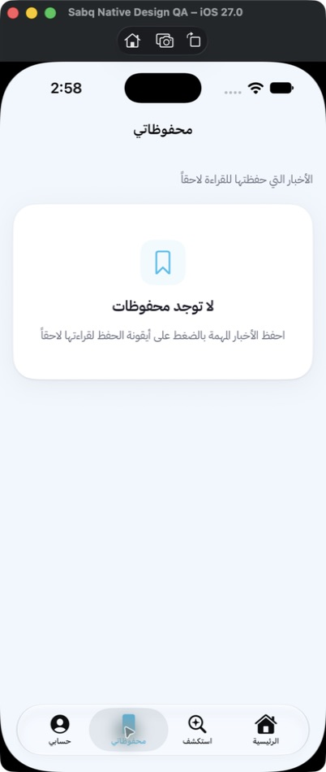
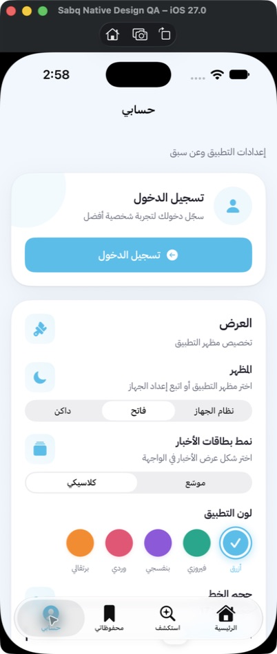
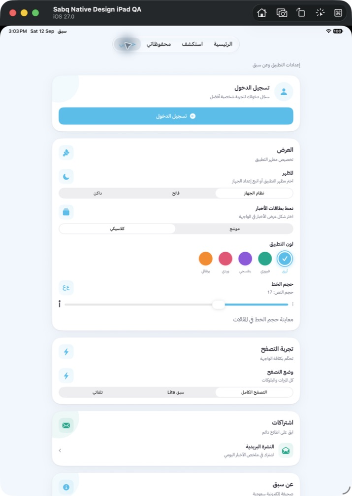

# تعميم التصميم الأصلي على بقية شاشات سبق

التاريخ: 12 سبتمبر 2026. دفعة تسليم مستقلة في `codex/ios27-complete-screens`؛ حالة التسليم موثقة في `DELIVERY.md`.

## نطاق هذه الدفعة

**32 شاشة ونافذة إضافية** تلقّت تعديلات مباشرة في العرض أو التنقّل؛ العدد للشاشات التي يراها المستخدم، وليس لملفات Swift. سياسة الخصوصية والشروط تستخدمان قالباً واحداً، ومُقترب وعُمق يضمّان أكثر من شاشة في الملف نفسه.

| المجموعة | الشاشات | التغيير |
|---|---|---|
| التبويبات الرئيسية (2) | محفوظاتي، حسابي | عناوين النظام، مقدمة مختصرة، إحصاءات محفوظات في مساحة واحدة تتكيف مع تكبير النص، اختصارات الحساب صفوف واضحة بدلاً من بطاقات كبيرة |
| التصفّح والمحتوى (10) | الأقسام، المقالات، الكاتب، الوسم، الأكثر تداولاً، التقويم، النشرات الصوتية، لك، التغطية المباشرة، لحظة بلحظة | إزالة أزرار الرجوع اليدوية المتبقية، عناوين تنقّل أصلية، تخفيف الرؤوس المتكررة في التقويم والصوت والرائج، اختيار الأخبار عبر منتقي النظام |
| القراءة والتحليل (8) | قائمة عُمق وتحليل عُمق، مُقترب والزوايا والموضوع والكاتب، تفاصيل الرأي، قارئ Lite | رجوع النظام، أزرار مشاركة وحفظ أصلية في القارئين، أسماء وصول واضحة، عرض قراءة محدود في الرأي وLite على الشاشات الواسعة |
| الاقتصاد (1) | الاقتصاد بالأرقام | إظهار شريط تنقّل النظام وإزالة شريط الرجوع داخل المحتوى والمساحة السفلية الزائدة |
| التنبيهات (2) | إعدادات الإشعارات، تنبيهات المباريات | عناوين ورجوع النظام مع الإبقاء على تفضيلات الإشعارات ووظائفها |
| النوافذ والصفحات المساندة (9) | الدخول، تعديل الملف، تغيير كلمة المرور، استعادتها، حذف الحساب، التواصل، النشرة البريدية، الخصوصية، الشروط | إغلاق أصلي ذو تسمية وصول في النوافذ، ورجوع النظام للصفحات القانونية؛ لم يتغير محتوى السياسة أو إجراءات الحساب |

## التحسينات المشتركة لبقية التطبيق

- خط IBM Plex Sans Arabic وأوزانه الأساسية محفوظة؛ النص الصغير والمتن والعناوين التي تستخدم `SabqFonts.app` تتدرّج الآن مع فئات النص المناسبة لكل منها بدلاً من منحنى المتن نفسه للجميع. يصل ذلك إلى شاشات البطولات والولاء والتحرير التي تستخدم المكوّن ذاته.
- حالات الفراغ والخطأ المشتركة أخف وأيقوناتها ثابتة؛ أزرار المحاولة تستخدم شكل النظام.
- تأثير التحميل المشترك يحترم «تقليل الحركة». هذه ليست شهادة بأن كل حركة مستقلة في كل شاشة اختُبرت.
- خيارات العرض في الحساب وفلتر لحظة بلحظة تتحول من مقاطع إلى قوائم عند أحجام الوصول الكبيرة حتى لا تضيع الخيارات.
- اختيار لون التطبيق يظهر علامة صح وقراءة اختيار واضحة، وشريط حجم الخط له تسمية وقيمة مقروءة.
- «حسابي» على iPad يستخدم شاشة مستقلة بعرض محتوى أقصى 760 نقطة بدلاً من عمود ضيق ومساحة قراءة فارغة. الأخبار والمحفوظات تحتفظ بالأعمدة المناسبة للقراءة.

الشاشات التي كانت تستخدم تنقّل النظام بالفعل — مثل مراكز المباريات والمكافآت ولوحات التحرير — احتفظت بتوزيعها ووظائفها، واستفادت من المكونات المشتركة. لا يعني ذلك إعادة تصميم داخلية كاملة لكل شاشة رياضية أو إدارية.

## التحقق

- بناء Debug ناجح، بما فيه إصلاح تخطيط الحساب على iPad.
- بناء Release النهائي نجح دون توقيع. الحد الأدنى iOS 17.0 مؤكد من ملف التطبيق الناتج. الاختبار المحلي استخدم إعداد المستخدم 10.3.2؛ تعديل رقم الإصدار ليس ضمن هذه الدفعة.
- 99 اختباراً وظيفياً في 12 مجموعة واختبارا تنقّل نجحت بعد تغييرات الشاشات والخطوط.
- أُعيد تشغيل اختبارَي التنقّل بعد تعديل تخطيط الحساب على iPad ونجحا كلاهما.
- معاينات فعلية على محاكي iPhone: المحفوظات، الحساب، نافذة الدخول، والوضع الداكن بأكبر حجم نص في الحساب.
- معاينة نهائية لحساب iPad أكدت عرض المحتوى في شاشة مستقلة واختفاء عمود القراءة الفارغ.
- لا حساب اختبار مصادقاً عليه: لم تُجرّب كتابة أو إرسال بيانات أو تغييرات حساب حقيقية. الحالات المسجّل دخولها، والوظائف الإدارية الخاصة، وكل حالات الجداول الرياضية عند أكبر خط تحتاج تغطية جهازية أوسع قبل اعتماد الإصدار.
- الحد الأدنى iOS 17 محفوظ. المحاكي المستخدم iOS 27؛ لا يوجد هنا إثبات تشغيل لهذه الدفعة على جهاز iOS 17 أو أرشيف موقّع جاهز لرفع Apple.

## أدلة البناء والاختبار

- `/tmp/sabq-remaining-design-tests.xcresult`
- `/tmp/sabq-remaining-design-final-navigation.xcresult`
- `/tmp/sabq-remaining-design-final-build.log`
- `/tmp/sabq-remaining-design-final-release.log`
- المعاينات في `/Users/alialhazmi/Documents/Codex/2026-09-12/sabq-remaining-screens/`.

## المعاينات

