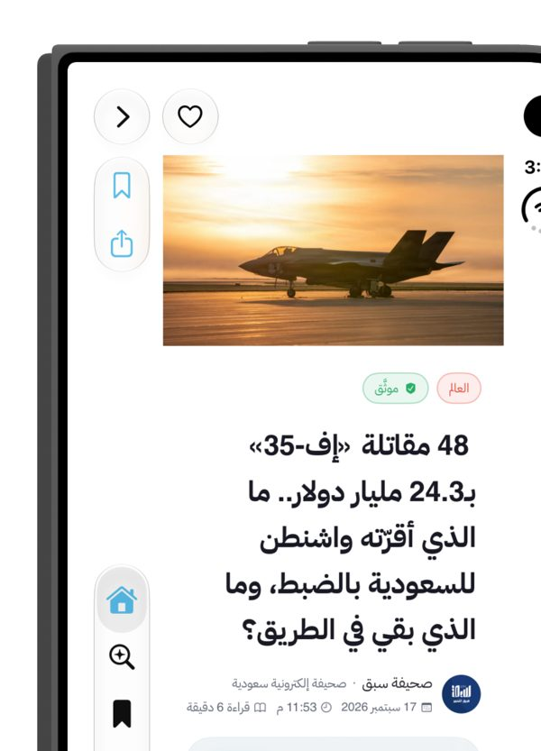
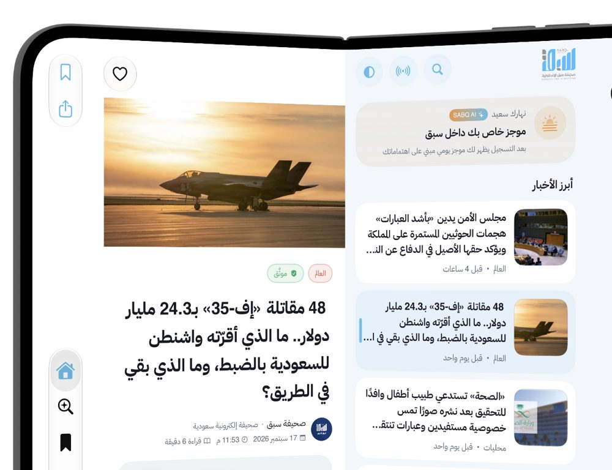
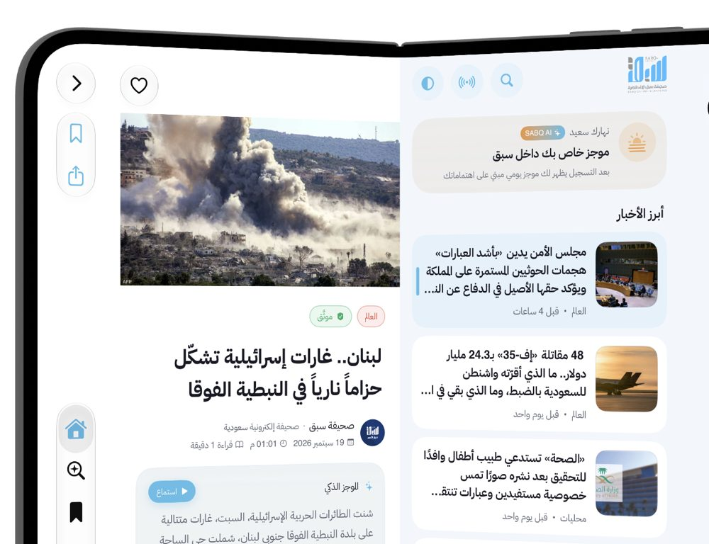
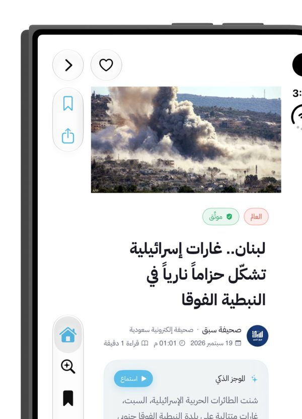
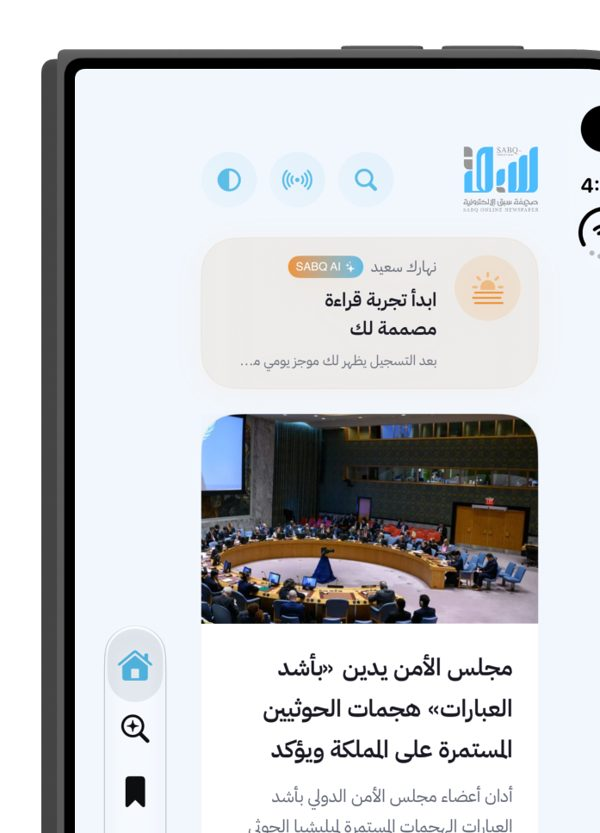
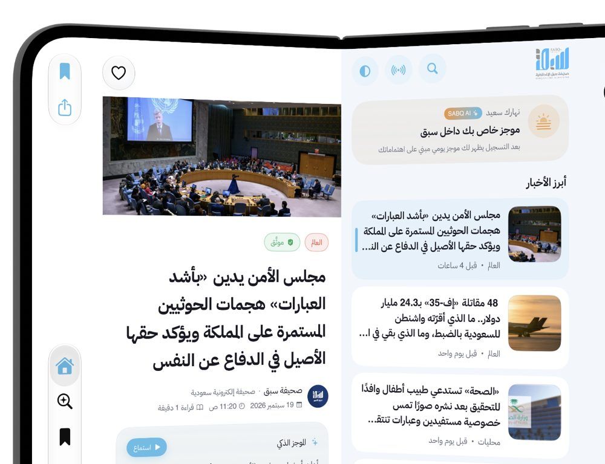
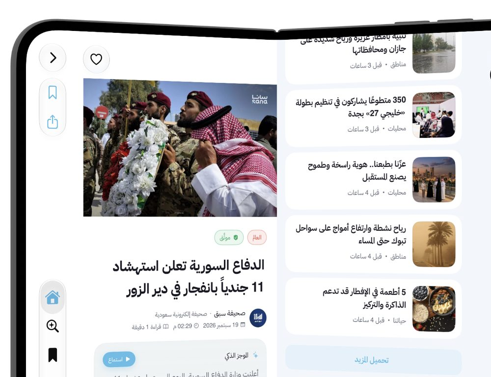
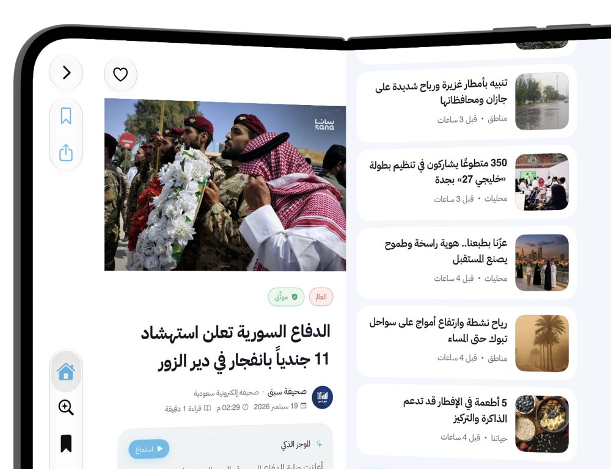

# تطبيق سبق iOS على iPhone Duo — المراجعة والتنفيذ (19 سبتمبر 2026)

**النطاق:** `sabq app ios` (SwiftUI، الحد الأدنى iOS 17) على الفرع `claude/project-thread-i990wh` فوق `526047c` (PR ‏#1683 مسودة).
**المرجع:** Tech Talks «Prepare your app for iPhone Duo» و«Strike a pose with adaptive layouts on iPhone Duo».
**البيئة:** Xcode 27.1 (27A9269)، محاكي iPhone Duo iOS 27.1 عبر Device Hub. كل ملاحظة موسومة بـ **[تحقق]** (رأيته في الكود أو المحاكي) أو **[استنتاج]** أو **[يلزم جهازًا]**.

هذا التقرير يحل محل مسودتين سابقتين بالتاريخ نفسه (`ios-duo-layout` و`ios-duo-sidebar-pinning`) كانتا تصفان نهجين مختلفين؛ نُقلتا إلى `tmp/ios-duo-wip/superseded/` ولم تعودا مرجعًا.

---

## 1. الخلاصة

- التطبيق سليم في النقاط التي تكسر التطبيقات على Duo بحسب Apple (لا `UIScreen.main`، لا حساب يدوي للحواف، الاتجاهات معلنة، تعدد المهام مسموح).
- **المشكلة الجوهرية كانت فقدان المقال عند الطيّ**، وقد **أُصلحت وثُبتت على المحاكي** بجسر بين خبر القارئ ومكدّس التنقل (§3-A).
- **خمس ملاحظات إضافية نُفذت في الجولة نفسها**: توحيد ورقة المشاركة، الوضع الخفيف في العمود، شبكات متكيفة في 12 موضعًا، معرّف وصولي للصفوف، واختبارات وحدة للجسر.
- **ملاحظة من المراجعة الأولى تبيّن أنها غير صحيحة**: سقف عرض النص في القارئ موجود أصلًا (720 نقطة) في `ArticleDetailView` و`OpinionDetailView`.
- **الحاوية الثابتة اعتُمدت ونُفذت على Duo فقط** (§A2): `NavigationSplitView` واحد لا يُهدم عند الطيّ، مقيّد بكشف الجهاز القابل للطيّ فلا يمس أي جهاز آخر. المؤجل: `.sidebarAdaptable` الذي يتطلب iOS 18.

---

## 2. ما تحققت منه وهو سليم [تحقق]

| البند | الدليل |
|---|---|
| لا `UIScreen.main` في كود التطبيق | الإشارة الوحيدة تعليق في `HomeFeedView.swift`؛ `XCUIScreen` في اختبارات الواجهة فقط |
| لا حساب يدوي على `safeAreaInsets` | صفر نتائج في `sabq/` و`SabqWidgets/` |
| `ignoresSafeArea` على الخلفيات فقط | 20 موضعًا كلها `.background(... .ignoresSafeArea())` |
| القرار «عريض/ضيق» يقرأ صنف الحجم **وعرض النافذة** | `SabqNavigation.swift`: `sizeClass == .regular || width ≥ 640`؛ Duo مفتوحًا رأسيًا يبلّغ `.compact` رغم عرضه ≈ 700 |
| الشاشة الداخلية تحصل على عمود + قارئ ثابتين بلا طبقة معتمة | `NavigationSplitView(columnVisibility: .constant(.all))` + فرض `.regular` داخل الفرع العريض + إزالة `sidebarToggle` — لقطة 01 |
| القارئ يفتح أبرز خبر فورًا بدل شاشة فارغة | `HomeReaderRoot` — لقطة 01 |
| RTL مفروض فالعمود على اليمين والقارئ على اليسار | `SabqRTL.swift` — لقطات 01/03 |
| عرض عمود نص المقال مسقوف عند 720 نقطة | `ArticleDetailView.swift:232`، `OpinionDetailView.swift:108` |
| ارتفاع الكاروسيل يُقاس من الحاوية | `HomeFeedView.swift` (F11 من تدقيق iOS 27) |
| الاتجاهات كلها معلنة؛ لا `UIRequiresFullScreen` | `project.pbxproj`، `Info.plist` |
| الملفات الجديدة تدخل المشروع تلقائيًا | `PBXFileSystemSynchronizedRootGroup` |

---

## 3. الملاحظات وما نُفذ

### A. فقدان المقال عند الطيّ — **نُفذ وثُبت** [تحقق بالمحاكي]

**الجذر:** التخطيطان العريض (Split) والضيق (Stack) يتشاركان `paths[.home]`، لكن الخبر المفتوح في عمود القارئ يعيش في `SabqNavigationState.homeReaderArticle` لا في المكدّس. عند الطيّ يُبنى الفرع الضيق بجذر `HomeFeedView` ومكدّس فارغ، فيعود المستخدم إلى الصفحة الأولى ويُسقط الخبر.

**الإصلاح:** `homeLayoutDidChange(isWide:)` في `SabqNavigationState`، يُستدعى من `SabqTabNavigation` عبر `onLayoutChange` عند تغيّر «عريض» (`ContentView` يمرّره لتبويب الرئيسية فقط):
- طيّ (عريض → ضيق): إن كان المكدّس فارغًا والقارئ على خبر اختاره المستخدم، يُدفع الخبر إلى المكدّس فيبقى على الشاشة الخارجية.
- فتح (ضيق → عريض): إن كان المكدّس ما زال يحمل ذلك الخبر وحده، يُزال لأن القارئ يعرضه أصلًا. إن تعمّق المستخدم بعده (كلمة مفتاحية، كاتب…) يبقى المكدّس فوق القارئ.
- الخبر التلقائي (لم يختره المستخدم) لا يُجسَّر؛ الطيّ حينها يعود إلى الصفحة الأولى عمدًا.

**الإثبات على المحاكي (Device Hub، أزرار الوضعية):**

| # | الحالة | اللقطة |
|---|---|---|
| 01 | مفتوح — اختيار الصف الثاني («إف-35»)، الصف مُبرز والقارئ عليه بلا زر رجوع |  |
| 02 | مطوي — الشاشة الخارجية على الخبر نفسه مع زر رجوع (المكدّس يحمله) |  |
| 03 | أُعيد الفتح — الخبر في القارئ بلا زر رجوع (أُزيل من المكدّس)، والتحديد باقٍ |  |
| 04 | مفتوح — رابط «مقالات ذات صلة» داخل القارئ دفع صفحة (زر رجوع) |  |
| 05 | مطوي — الصفحة المدفوعة باقية على الخارجية (المكدّس المشترك) |  |

**اختبارات وحدة** (Swift Testing، `sabqTests/NativeNavigationTests.swift`): ست حالات للجسر (طيّ مع اختيار، فتح يزيل المجسَّر فقط، تعمّق بعد الطيّ، بلا اختيار، مكدّس غير فارغ، المستخدم رجع قبل الفتح) — 8/8 ناجحة على iPhone 17.

**اختبار واجهة مساعد** (`sabqUITests/DuoReaderBridgeTests.swift`): يلمس الصف الثاني عبر المعرّف `homeSidebarRow` ثم ينتظر `TEST_RUNNER_DUO_BRIDGE_HOLD_SECONDS` ليُطوى الجهاز ويُفتح من الخارج. يتخطى نفسه (`XCTSkip`) على العرض الضيق. يُشغَّل يدويًا بـ `-only-testing`.

### A2. الحاوية الثابتة على Duo فقط — **نُفذ وثُبت** [تحقق بالمحاكي]

**قرار المالك (المساء نفسه):** اعتماد الاستبدال بشرط ألا يمس أي جهاز آخر.

**التنفيذ:** `Services/FoldableDevice.swift` يكشف القابل للطيّ بطريقتين (معرّف الطراز `iPhone19,4`، أو ملاحظة مُتعلَّمة: نافذة هاتف ضلعها الأقصر ≥ 600 نقطة تُحفظ في `UserDefaults`). على هذه الأجهزة فقط يستخدم `SabqTabNavigation` مسار `stableSplitLayout`:
- `NavigationSplitView` واحد في الوضعين، لا يُهدم عند الطيّ. صنف الحجم يُفرض `.regular` على الـ Split View نفسه كي **لا ينهار** إلى عمود واحد على الشاشة الخارجية، ثم تُعاد القيمة الحقيقية لمحتوى العمودين.
- الطيّ يغيّر أمرين فقط: `columnVisibility` من `.all` إلى `.detailOnly` (الرابط يرفض تغيير الإيماءات)، وجذر عمود القارئ من `HomeReaderRoot` إلى `HomeFeedView`. `NavigationStack` القارئ ومساره `paths[.home]` هما نفسهما في الوضعين.
- الجسر (A) يبقى كما هو فوق هذا المسار.
- الآيفون العادي وiPad وMax أفقيًا يبقون على مسار التبديل السابق حرفيًا (الشرط `FoldableDevice.isFoldable`). تحقق: iPhone 17 بعد التغيير يعرض الرئيسية والرابط العميق كما كان.

**الإثبات:**

| # | الحالة | اللقطة |
|---|---|---|
| 06 | إقلاع مطويًا: الصفحة الأولى الكاملة داخل الحاوية الثابتة، بلا عمود ولا طبقة |  |
| 07 | فتح: عمود + قارئ من الحاوية نفسها |  |
| 08 | مفتوح: مقال ذو صلة مدفوع في القارئ، والعمود ممرَّر حتى «تحميل المزيد» |  |
| 09 | مطوي: المقال المدفوع باقٍ بزر رجوع (المكدّس نفسه) |  |
| 10 | أُعيد الفتح: **موضع تمرير العمود محفوظ** والمقال المدفوع باقٍ — الشجرة لم تُهدم |  |

**حدود ما ثُبت:** الخبر المختار من العمود يُدفع إلى المكدّس عند الطيّ (الجسر) فيُنشأ من جديد ويعيد الجلب؛ ما يبقى بحالته هو كل ما دُفع فوقه والعمود نفسه. تمرير القارئ لم يُقَس مباشرة لأن XCUITest لم يلتقط `ScrollView` القارئ كعنصر قابل للمس، لكن بقاء تمرير العمود دليل على الآلية نفسها. الرابط العميق عبر `simctl openurl` على محاكي Duo يعترضه حوار «Open in سبق?» النظامي فلم يُختبر؛ آليته هي `paths[.home]` المشترك نفسه الذي ثبتت نجاته باللقطات 08–10.

### B. سقف عرض النص في القارئ — **لا يلزم عمل** [تحقق]
المراجعة الأولى أوردته P1 خطأً. `ArticleDetailView` و`OpinionDetailView` تسقفان العمود النصي عند `min(proxy.size.width - 40, 720)` مع بقاء الهيرو بعرض القارئ. هذا هو الحل المقترح نفسه.

### C. شبكات بعمودين ثابتين — **نُفذ في 12 موضعًا** [تحقق للكود]
`Components/SabqGrid.swift`: `SabqGrid.adaptive(minimum: 150, spacing:)` → `[GridItem(.adaptive(minimum:))]`. على الهاتف (343 نقطة متاحة) يبقى عمودان كما كان؛ على القارئ العريض/iPad تزيد إلى 3–4.
المحوّل: `EconomyView` (5)، `HomeFeedView` (مصغّرات الرأي)، `SabqPlusView`، `DailyBriefView`، `Settings/NewsletterSheet`، `AITeamView`، `WorldCupHub`، `AdminDashboardView` (2)، `PassportSheetView`، `SectionsView`، `ContributorDashboardView` (بطاقات الإحصاءات).
**تُرك عمدًا:** شبكات الشعارات الثلاثية/الرباعية (`AsianCupView`، `WorldCupPredictions`، `ContributorDashboardView:950`) لأن عددها الثابت مقصود تصميميًا. [يلزم لقطة] للشبكات على القارئ العريض لم تُلتقط في هذه الجولة.

### D. ورقة مشاركة بلا تثبيت popover — **نُفذ** [تحقق للكود]
`ArticleLiteView.share()` كان يقدّم `UIActivityViewController` مباشرة بلا مرساة (انهيار محتمل على iPad/Duo مفتوحًا). وُحّد على `SabqShareHelper.presentShareSheet(with:title:completion:)` الذي صار يحمل العنوان اختياريًا، ويثبّت الـ popover، ويقدّم فوق أعلى متحكم معروض بدل الجذر. `LiveCoverageView` تحتفظ بنسختها المثبّتة.

### H. الوضع الخفيف في العمود — **نُفذ** [تحقق للكود]
`HomeSidebarView` يقرأ `LiteModeManager`: يخفي المصغّرات في الصفوف (`showsThumbnail`) ويعرض `LiteBannerView` أعلى العمود كما في `HomeFeedView`. القارئ المجاور كان يتحوّل أصلًا إلى `ArticleLiteView`.

### E. إيماءة الرجوع المعدّلة عامًا — **لم تُختبر** [يلزم جهازًا]
`NavigationGestureBridge.swift` يستبدل مندوب `interactivePopGestureRecognizer` لكل `UINavigationController`. في Split View لكل عمود متحكم خاص؛ السحب من الحافة اليمنى (RTL) في القارئ قد يتنازع مع حافة العمود أو المفصلة. لم يُختبر لأن النقر الاصطناعي لا يصل إلى محتوى المحاكي.

### F. `presentationDetents(.medium)` على العرض المنتظم — [يلزم المحاكي]
`ArticleSubmissionView`، `SabqPlusView`، `WriterWorkspaceView`: على العرض المنتظم تصير نماذج مركزية وتتجاهل الـ detents. مقبولة غالبًا؛ لم تُصمَّم لذلك.

### G. الأغطية الكاملة على الشاشة الداخلية — [يلزم المحاكي]
التوقعات (`KingsCupView`، `WorldCupView`)، Onboarding، الصورة المكبّرة: تغطي الشاشة الداخلية بمحتوى مصمّم للهاتف.

### P3 — طفيفة
- **I.** الصورة البديلة للهيرو بارتفاع ثابت 220 (`ArticleDetailView`، `OpinionDetailView`): شريط منخفض عريض على القارئ العريض. [تحقق]
- **J.** ميزانية بكسلات الهيرو 1400/1600: قارئ 700 نقطة على 3x يطلب 2100 فيُكبَّر قليلًا. [استنتاج]
- **K.** الشاشة الخارجية تعمل كآيفون عادي (لقطة `08` في `tmp/ios-duo-wip/`). [تحقق]
- **M.** الويدجت والنشاط الحي: لا شيء يخص الشاشتين في الكود. [يلزم جهازًا]
- **N.** واجهات iOS 27.1 (`ReservedRegion`، `ConcentricRectangle`) غير مستخدمة؛ لا عنصر ثابت يعبر المفصلة إلا فاصل الـ Split View. تحسين اختياري.
- **O.** تطبيقات البطولات (`gulf-cup`، `asian-cup`): `TARGETED_DEVICE_FAMILY = 1` بلا أصناف حجم. خارج النطاق.
- **P.** `.sidebarAdaptable` يتطلب iOS 18 حدًا أدنى. قرار المالك.

---

## 4. الملفات المتغيرة في هذه الجولة

| الملف | التغيير |
|---|---|
| `Components/SabqNavigation.swift` | `homeLayoutDidChange`، `onLayoutChange`، `stableSplitLayout` (Duo فقط)، (سابقًا: عتبة العرض، `.constant(.all)`، `HomeReaderRoot` كجذر للقارئ) |
| `Services/FoldableDevice.swift` | جديد: كشف القابل للطيّ (طراز معروف أو ملاحظة مُتعلَّمة) |
| `ContentView.swift` | تمرير `onLayoutChange` للرئيسية، `tabDetail` |
| `Screens/HomeReaderRoot.swift` | جديد: جذر القارئ يفتح المختار أو أبرز خبر |
| `Screens/HomeSidebarView.swift` | العمود المضغوط، `openInReader`، الوضع الخفيف، `homeSidebarRow` |
| `Components/SabqShareHelper.swift` + `Screens/ArticleLiteView.swift` | توحيد المشاركة |
| `Components/SabqGrid.swift` + 11 شاشة | الشبكات المتكيفة |
| `sabqTests/NativeNavigationTests.swift` | 6 اختبارات للجسر |
| `sabqUITests/DuoReaderBridgeTests.swift` | اختبار اللمس المساعد |

**التحقق:** `xcodebuild build` لـ iPhone Duo ناجح؛ اختبارات الوحدة 8/8؛ اللقطات أعلاه من Device Hub.

---

## 5. تشغيل المحاكي من الطرفية (Xcode 27.1)

لا يوجد `Simulator.app`؛ البديل `Xcode.app/Contents/Applications/DeviceHub.app`. أزرار الوضعية أسفل نافذة الجهاز تُضغط عبر AX بلا سرقة تركيز:
```
osascript -e 'tell application "System Events" to tell process "DeviceHub" to click button N of group 1 of window 1'
```
N=5 مطوي، N=6 مفتوح، N=7 وضع الكتاب، N=4 تدوير. اللقطات الموثوقة بالتقاط نافذة Device Hub (`screencapture -l <CGWindowID>`)، لأن `simctl io screenshot` بلا `--display` يلتقط الشاشة الخارجية. **لا تُطفأ الشاشة الداخلية بـ `screenConfig power off`** لمحاكاة الطيّ: تعلّق سوداء ولا تعود إلا بإعادة تشغيل المحاكي.

---

## 6. المقترح التالي (بإذن المالك)

1. تخطّي إعادة الجلب في `ArticleDetailView` حين يكون المقال الكامل في ذاكرة الجلسة، فيصير الخبر المجسَّر عند الطيّ فوريًا.
2. لقطات للشبكات المتكيفة على القارئ العريض (C) وللأوراق `.medium` (F).
3. اختبار إيماءة الرجوع (E) والرابط العميق على جهاز Duo حقيقي.
